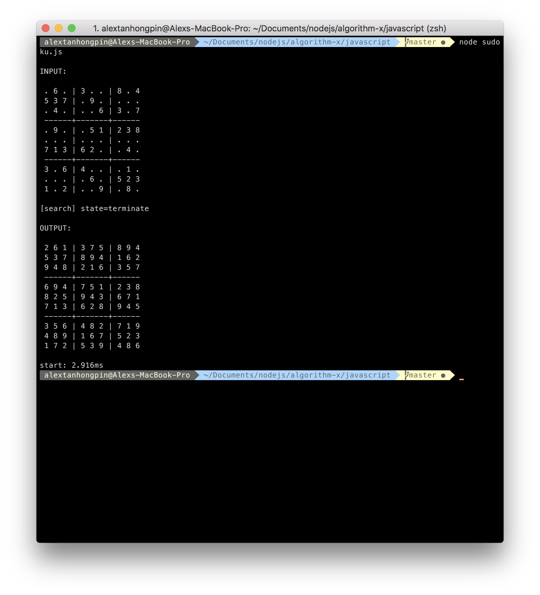

# sudoku-solver

Sudoku solver implementing DLX (Dancing Links + Algorithm X) by Donald Knuth.



## Installing Virtualenv
```bash
pip3 install virtualenv
```

## Setting up Virtualenv
```bash
$ virtualenv venv
$ source venv/bin/activate
$ deactivate
```

## Install Dependencies
Only install after setting up virtualenv to avoid polluting the global namespace.
```
pip3 install numpy
```

## Run 
```bash
$ python3 main.py
```

## Dancing Links

```
If A is empty, the problem is solved; terminate successfully.
Otherwise choose a column, c (deterministically).
Choose a row, r, such that A[r, c] = 1 (nondeterministically).
Include r in the partial solution.
For each j such that A[r, j] = 1,
    delete column j from matrix A;
    for each i such that A[i, j] = 1,
        delete row i from matrix A.
Repeat this algorithm recursively on the reduced matrix A.
```

# Rerefences
https://www.ocf.berkeley.edu/~jchu/publicportal/sudoku/0011047.pdf
https://www.kth.se/social/files/58861771f276547fe1dbf8d1/HLaestanderMHarrysson_dkand14.pdf


## Setup Typescript Testing

yarn add mocha @types/mocha chai @types/chai ts-node typescript --dev
